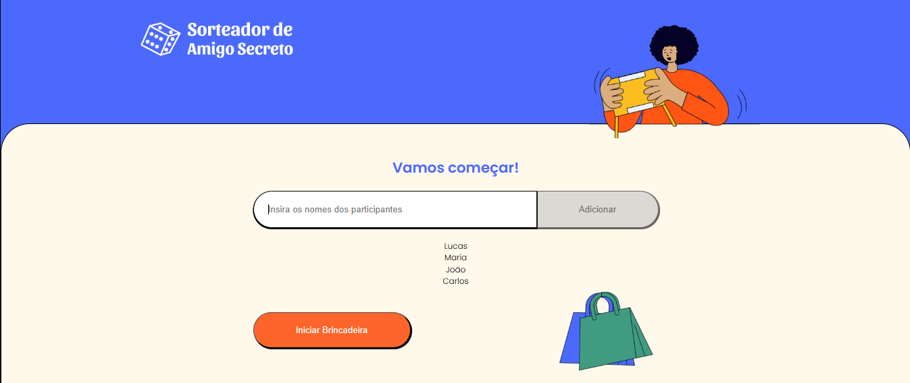
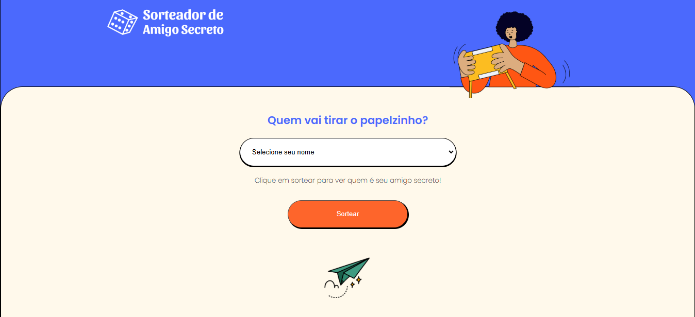
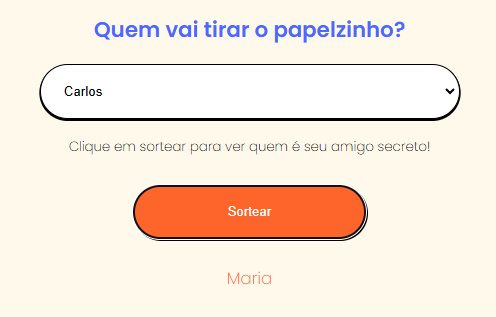
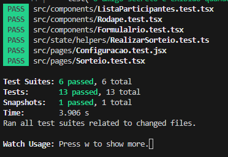

## Welcome again to another TypeScript - TDD project! 👋

# Amigo Secreto (Similar to "Secret Santa")!

## Test the project yourself: [Teste the project here!!!](https://test-driven-development-ts.vercel.app/)

### Home Page



## Draw lots page 



## Draw lots results



## Tests




## Some code that I'm proud of
```js
export const listaParticipantesState = atom<string[]>({
    key: 'listaParticipantesState',
    default: []
})

export const erroState = atom<string>({
    key: 'erroState',
    default: ''
})

export const resultadoDoAmigoSecreto = atom<Map<string, string>>({
    key: 'resultadoDoAmigoSecreto',
    default: new Map()
})
```

## Built with

- `React`
- `React Hooks`
- `TypeScript`
- `Recoil`
- `Jest`


## You Can
- Add names to be drawn;
- Receive an alert if the name is duplicated;
- Draw the pairs and find out who each person's Secret Santa is.


## Author

- Website - [My GitHub](https://github.com/lucasbailo)
- Frontend Mentor - [@lucasbailo](https://www.frontendmentor.io/profile/lucasbailo)
- Instagram - [@lucassbailo](https://www.instagram.com/lucassbailo/)
- LinkedIn - [Lucas Bailo](https://www.linkedin.com/in/lcsbailo)